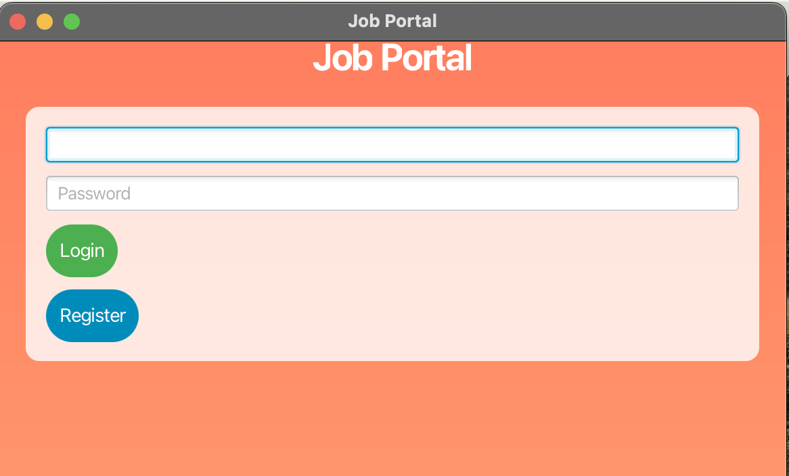

# Job Portal

A simple Job Portal application built using JavaFX. This application allows users to register, log in, create, edit, and delete job listings. It is designed to provide a user-friendly interface for managing job opportunities and allows HR managers or employers to manage job postings.

## Screenshots




## Features

- **User Authentication:**
  - User Registration
  - User Login
  - Logout

- **Job Management:**
  - Create a new job listing
  - Edit existing job listings
  - Delete job listings
  - View job listings in a scrollable list

## Technologies Used

- JavaFX for the graphical user interface
- FXML for designing the UI structure
- ObservableList for managing and displaying the job listings
- Stage and Scene for window management

## Installation

1. **Clone the repository:**

   ```bash
   git clone https://github.com/EMMMABK/Job-Portal.git
   cd Job-Portal
   ```

2. **Build the project:**
   
    You can use your preferred IDE (e.g., IntelliJ IDEA, Eclipse) to open the project.
    If you're using IntelliJ, ensure you have JavaFX configured in the project settings. If you encounter issues, please refer to JavaFX setup guide.

3. **Run the Application:**
   
   Run the `HelloApplication.java` class to launch the application.

## Usage

### 1. User Registration

- When you first launch the app, you'll be presented with a **login page**. You can either log in if you have an account or register a new account by clicking the "Register" button.
- Fill in your desired username and password and click "Register". Upon successful registration, you'll be taken to the **job portal** page.

### 2. User Login

- If you already have an account, enter your username and password on the login page and click "Login". If successful, you'll be redirected to the job portal page.

### 3. Job Management

Once logged in, you can:

- **Create a Job**: Enter job details like title, salary, responsibilities, certifications, and work schedule, and click "Create Job".
- **Edit a Job**: Select a job from the list, make changes to the title and other details, and click "Edit Job".
- **Delete a Job**: Select a job and click "Delete Job" to remove it from the list.

### 4. Logout

- To log out, click the **Logout** button in the job portal. This will return you to the login page.

## Folder Structure

```
job-portal/
│
├── src/
│   ├── org/example/jobportal/       # Source code directory
│   │   ├── HelloApplication.java
|   |   |   HelloController.java     # Main controller for the application
│   │   └── resources/
│   │       ├── hello-view.fxml       # FXML file for the UI
│   │                 
│
├── README.md                       # Project documentation
├── .gitignore                      # Git ignore file
└── pom.xml                          # Maven project file (if using Maven)
```

## Future Enhancements

- Implement user authentication with a database
- Add search functionality to filter job listings
- Implement pagination for job listings
- Enhance user interface with more sophisticated layouts and animations
- Add a feature for users to apply to job listings

## Contributing

Contributions are welcome! If you'd like to improve the app or fix a bug, feel free to:

1. Fork the repository.
2. Create a new branch:
   ```bash
   git checkout -b feature-name
   ```
3. Make your changes and commit them:
   ```bash
   git commit -m "Add your message here"
   ```
4. Push the branch:
   ```bash
   git push origin feature-name
   ```
5. Submit a pull request.

## License

This project is licensed under the MIT License - see the [LICENSE](./LICENSE) file for details.
